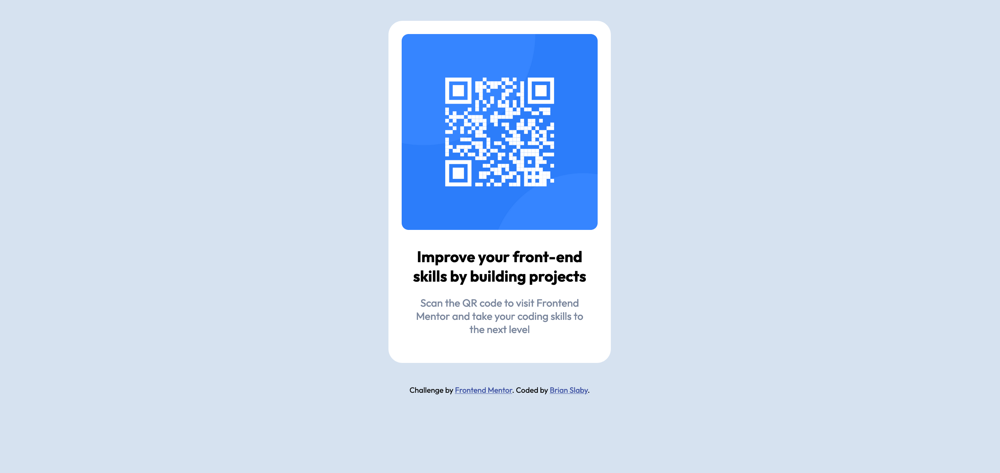

# Frontend Mentor - QR code component solution

This is a solution to the [QR code component challenge on Frontend Mentor](https://www.frontendmentor.io/challenges/qr-code-component-iux_sIO_H). Frontend Mentor challenges help you improve your coding skills by building realistic projects. 

## Overview

I wanted a quick project that I could complete in about an hour, and this is the recommended starting project on Frontend Mentor.  Just a simple component using HTML and CSS.

### Screenshot

